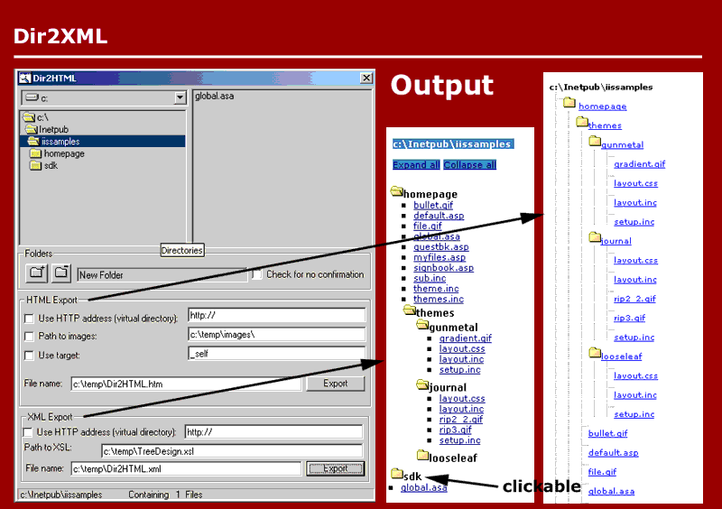



## Dir2XML

### Description

Dir2XML exports the directory structure, from a root folder of your choice on, in an XML file. I supplied a DTD to validate the XML, a XSL transform to render it in Internet Explorer, a CSS and some JavaScript to convert the whole into a nice DHTML application. This application is actually an extension of my Dir2HTML app and adds some nice features: dynamic HTML to collapse and expand on clicking folders, DHTML coloring on mouseover and a better lay-out in general. I think the XML should also be useful outside the browser now (you can use the MSXML to parse the nodes in VB for example) and is a nice example as well of how XML, XSL, CSS and JavaScript work together.
 
### More Info
 
The directory of your choice

You need some good background in different languages (XML, JavaScript, XSL, CSS, VB) I think to understand how the various aspects of the application work. But it's rewarding, I think.

an XML file, renderable on screen via XSL

The XML export is only useful in IE I'm afraid. To use it for netscape you need to convert the XML via XSL on the server side. I do explain how in the ReadMe.txt file.

             |
---                |---
**Submitted On**   |2001-03-15 11:43:04
**By**             |[Frodooo](https://github.com/Planet-Source-Code/PSCIndex/blob/master/ByAuthor/frodooo.md)
**Level**          |Advanced
**User Rating**    |4.6 (55 globes from 12 users)
**Compatibility**  |VB 6\.0
**Category**       |[Internet/ HTML](https://github.com/Planet-Source-Code/PSCIndex/blob/master/ByCategory/internet-html__1-34.md)
**World**          |[Visual Basic](https://github.com/Planet-Source-Code/PSCIndex/blob/master/ByWorld/visual-basic.md)
**Archive File**   |[CODE\_UPLOAD170933152001\.zip](https://github.com/Planet-Source-Code/frodooo-dir2xml__1-21656/archive/master.zip)

